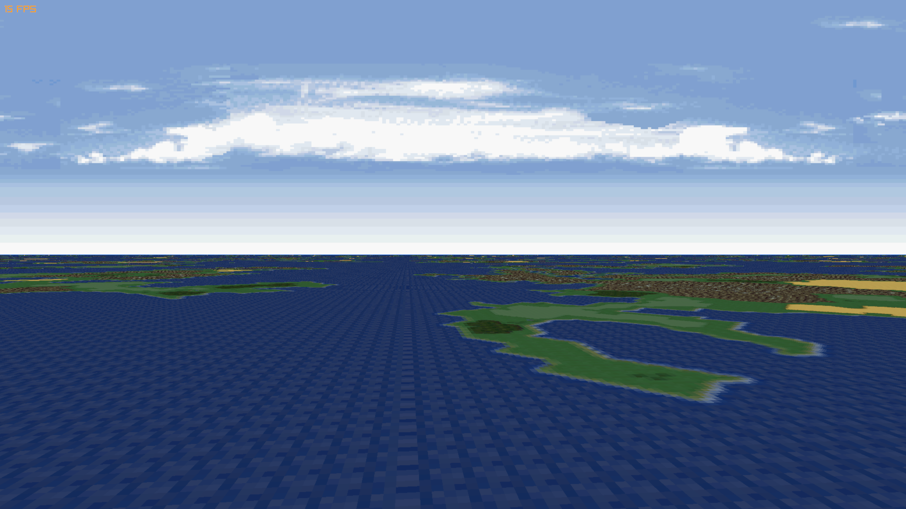

# Mode 7 simulator

## About

This is a simulator of the background graphical mode 7 on the SNES, which enables affine transformations on background textures.

**Learn more: ** 

## Demo
[ "Watch Demo"](https://youtu.be/0kVM6dJeWaY)